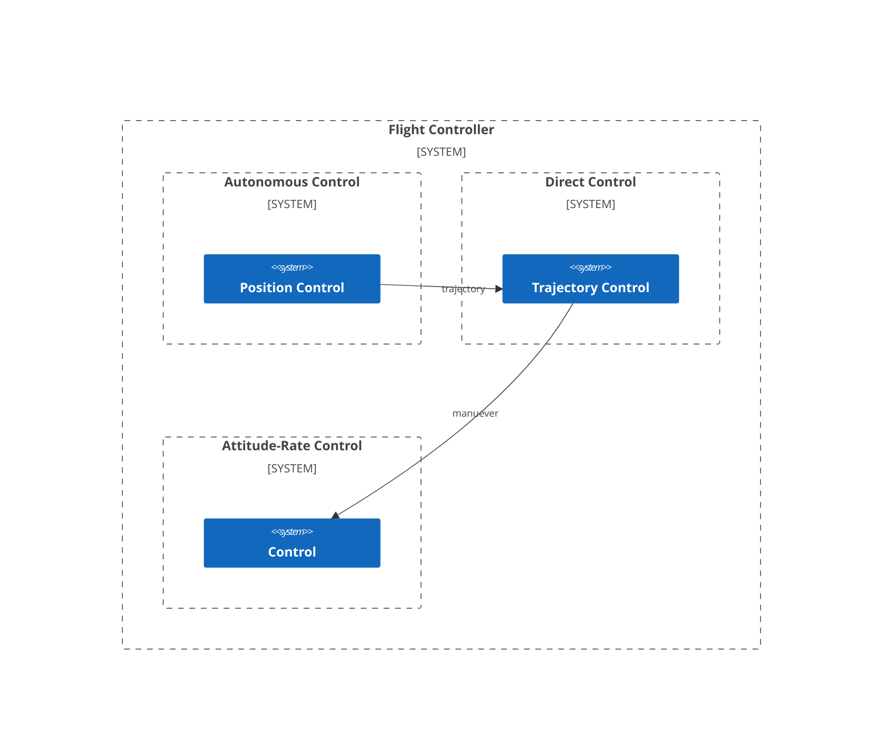

Multicopter Flight Controller Design
================================================================================
[General flight controller design](../../docs/design.md) describes
control design for any type of vehicle. As multicopters are able to hold
position, flight control designs for multicopters do not have to understand the
complexity of aerospace concepts. Aerospace terms (attitude, pitch, yaw, roll,
etc.) were created for airplanes and couple their usage toward the dynamics of
an airplane.

For multicopters, we can simplify the flight control design by thinking of
the vehicle as a point in space. To change the position of that point,
the flight controller needs only a
* trajectory
    * direction - unit 3D vector toward the objective position
    * velocity - rate toward objective position
        * trajectory manuevers require the multicopter to change orientation.
          As these orientations may not allow the multicopter to hold position,
          the velocity component is used to manage the climb/descent along the
          trajectory

### Background
* [Quadcopter Dynamics, Simulation, and Control](https://andrew.gibiansky.com/downloads/pdf/Quadcopter%20Dynamics,%20Simulation,%20and%20Control.pdf)
    - introduction to quadcopter physics
* [PX4 Architecture - Flight Stack](https://docs.px4.io/main/en/concept/architecture.html#flight-stack)
    * sound design based upon control-theory

### Implementation Guidance
What we need is a mathematically sound architecture that can be evaluated on current hardware.
[PX4 Controller Architecture](https://docs.px4.io/main/en/flight_stack/controller_diagrams)
is in use on current hardware and is based upon sound control-theory.

