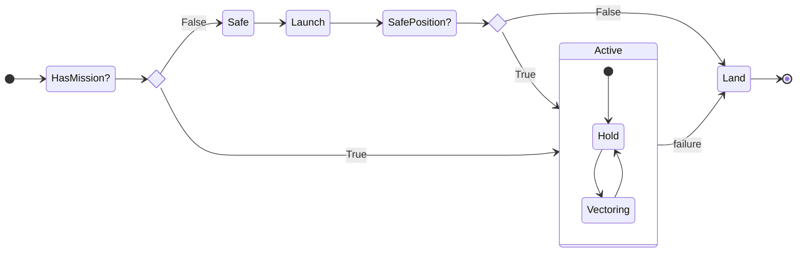

Flight Controller State Diagram
================================================================================

* HasMission? - the flight controller may reset at anytime (aka it may be in the air)
    * Safe - all motors disabled
        * Launch - achieve the initial position of the drone under controlled flight
            * SafePosition? - abort mission as soon as it can be determined the desired initial position can not be attained
    * Active
        * Hold - maintain position
        * Vectoring - move from current position towards mission directed position
    * Land - controlled descent by reducing motor speeds until all are 0 rpm